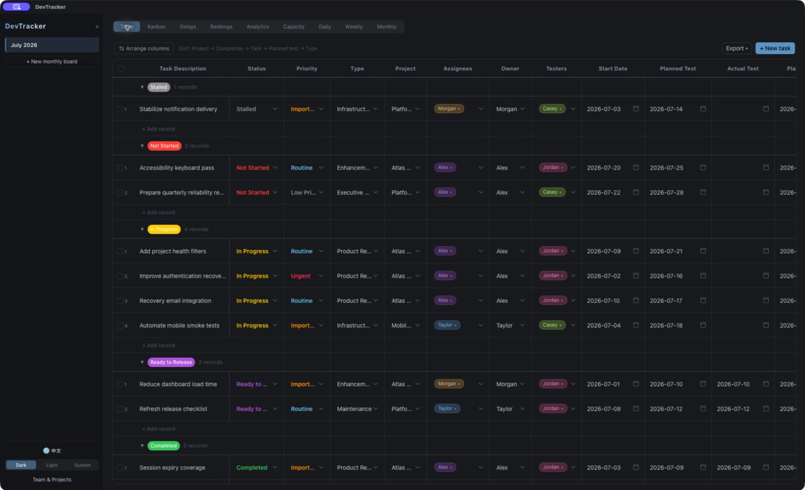
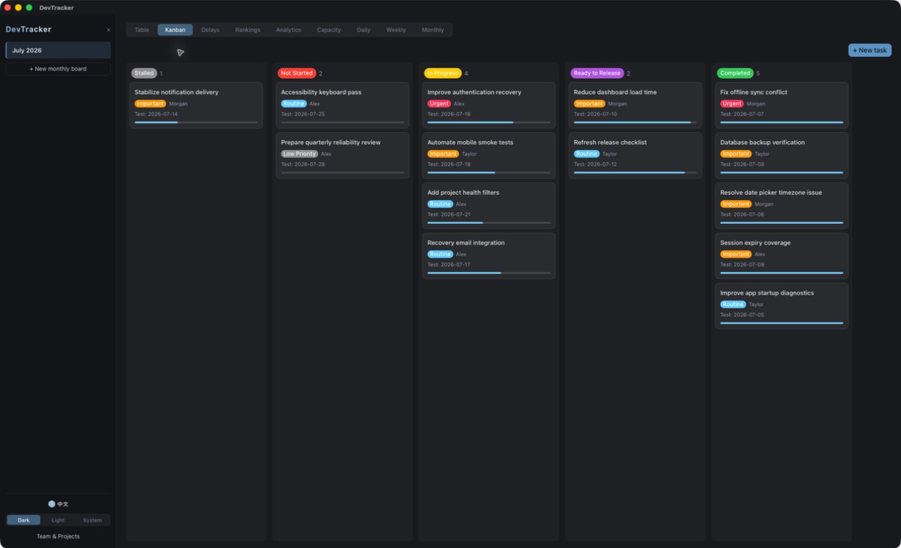
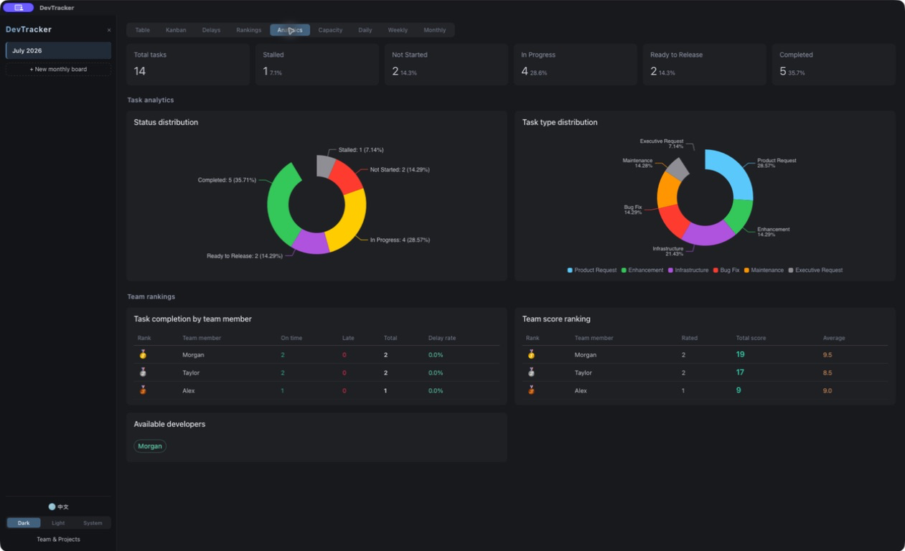

# DevTracker

[English](../README.md) | 简体中文

[](https://github.com/Hy-1990/DevTracker/actions/workflows/ci.yml)
[](https://vuejs.org/)
[](https://tauri.app/)
[](../LICENSE)

DevTracker 是一个本地优先的研发任务管理桌面应用，面向需要同时管理月度任务、交付节奏、人员负载与研发汇报的小型团队。它使用 Vue 3、TypeScript、Tauri 2、Rust 和 SQLite 构建，支持中文和英文界面，以及对应语言的日报、周报和月报。

> [GitHub Releases](https://github.com/Hy-1990/DevTracker/releases) 提供经过 ad-hoc 签名的 Apple Silicon DMG。由于尚未经过 Apple 公证，macOS 首次启动时需要手动允许。所有截图均使用虚构演示数据。

## 界面预览

### 分组任务表格



### 看板



### 统计分析



## 功能

- 月度任务表，支持父子任务、负责人、执行人、测试人员、项目、优先级、状态、日期、工时、进度和质量评分。
- 表格、看板、延期分析、交付排名、统计分析和人员容量视图。
- 中文与英文界面即时切换，语言选择保存在本机。
- 中文或英文日报、周报和月报；AI 提示词严格跟随当前界面语言。
- 导出 Excel、CSV、JSON 和 SQLite 数据库副本。
- 深色、浅色和跟随系统主题。
- 本地 SQLite 数据库，不依赖远程业务服务。

## 技术架构

```text
Vue 3 + TypeScript + Naive UI
            │
        Tauri Commands
            │
        Rust + SQLite
            │
  OS application data directory
```

前端负责交互、统计图表和报告生成；Tauri 命令负责数据库访问、文件导出和可选的 DeepSeek API 请求。数据库默认位于操作系统的应用数据目录，不存放在 Git 仓库中。

## 快速开始

### 在 Apple Silicon Mac 上安装

1. 从 [GitHub Releases](https://github.com/Hy-1990/DevTracker/releases/latest) 下载 `DevTracker_0.1.1_aarch64.dmg`。
2. 打开 DMG，将 DevTracker 拖入“应用程序”。
3. 尝试启动一次。如果 macOS 阻止打开，请进入 **系统设置 → 隐私与安全性**，找到 DevTracker 的安全提示并选择 **仍要打开**。

DMG 已进行 ad-hoc 签名并通过严格的 App bundle 签名校验，但尚未使用付费 Apple Developer ID 签名，也没有经过 Apple 公证。对于并非从本仓库下载的副本，请勿绕过系统警告。

### 环境要求

- Node.js 20 或更高版本
- npm
- Rust stable
- [Tauri 2 系统依赖](https://v2.tauri.app/start/prerequisites/)

### 开发

```bash
git clone https://github.com/Hy-1990/DevTracker.git
cd DevTracker
npm ci
npm run tauri dev
```

### 测试与构建

```bash
npm test
npm run build
cargo test --manifest-path src-tauri/Cargo.toml
npm run tauri build
```

`npm run tauri build` 会根据当前操作系统生成桌面安装产物。生成目录已被 Git 忽略。

在 macOS 上，可使用 `npm run release:build:macos` 生成可分发的 ad-hoc 签名 DMG。该命令还会检查磁盘镜像、完整 App bundle 签名、处理器架构和敏感文件类型。

## 数据与隐私

默认数据库位置：

- macOS：`~/Library/Application Support/DevTracker/data.db`
- Windows：用户 Local AppData 中的 `DevTracker/data.db`
- Linux：用户本地数据目录中的 `DevTracker/data.db`

可通过 `DEVTRACKER_DB_DIR` 环境变量指定其他目录。旧版本如果在项目的 `data/data.db` 中存在数据库，首次启动会使用 SQLite 一致性备份迁移到系统数据目录；旧文件不会自动删除。

仓库通过 `.gitignore`、CI 和隐私扫描脚本阻止数据库、备份、环境文件、私钥、本机绝对路径和高置信度凭据进入提交：

```bash
npm run privacy:test
npm run privacy:check
```

### AI 总结的隐私边界

DeepSeek API Key 保存在应用 WebView 的本机 `localStorage` 中，不写入项目或数据库。只有主动点击 AI 总结按钮时，当前报告内容和 API Key 才会发送到 DeepSeek API。报告可能包含任务、项目和人员信息，请在使用 AI 功能前确认这些内容允许发送给第三方服务。

不使用 AI 功能时，任务管理和普通报告生成完全在本机完成。

## 演示数据与截图

`scripts/demo-data.sql` 只包含虚构人员、项目和任务。运行：

```bash
scripts/run-demo.sh
```

脚本会在系统临时目录创建隔离数据库，退出后自动清理，不会读取或覆盖默认数据库。

## 项目结构

```text
src/                    Vue 前端、视图、状态与国际化
src-tauri/src/          Rust 命令、SQLite 数据层
scripts/                隐私检查与隔离演示数据
docs/                   本地化文档
docs/images/            README 演示截图
.github/workflows/      CI 验证
```

## 参与贡献

欢迎提交 Issue 或 Pull Request。提交前请运行完整测试和隐私检查，所有示例、日志、截图与测试数据必须使用虚构内容。

安全或隐私问题请阅读 [SECURITY.md](../SECURITY.md)，不要在公开 Issue 中粘贴数据库、日志、API Key 或真实业务数据。

## 许可证

[MIT License](../LICENSE)
